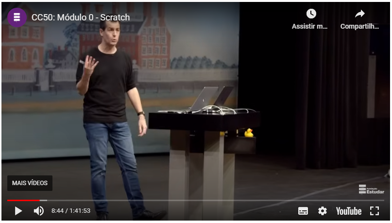

# CS50_Harvard-CC50_Ifood

Estou empolgado para compartilhar sobre a nova versão do CC50, o curso introdutório de Ciência da Computação de Harvard, que está repleto de conteúdo e novidades incríveis! Esse curso renomado mundialmente oferece uma sólida base em computação, Internet, programação e muito mais, tudo de forma gratuita.

Durante o curso, exploramos o funcionamento de computadores, a Internet e desenvolvemos habilidades em programação. Ao término, estaremos prontos para iniciar projetos em áreas como Web Design, Bancos de Dados, Sistemas Eletrônicos e Programação de Software. Apesar de desafiador, o curso é acessível a todos, independentemente da experiência em programação.

O professor David J. Malan utiliza uma didática incrível, tornando o aprendizado ainda mais enriquecedor. Todos os materiais, incluindo a tradução das aulas e dos Sets de Problemas, são diretamente do material original da Harvard (CS50 2021 - licença do CS50), garantindo que tenhamos acesso ao mesmo conhecimento dos alunos da universidade.

A experiência é aprimorada com o ambiente de desenvolvimento, conhecido como IDE, que agora conta com Inteligência Artificial. Isso significa que podemos programar sem a necessidade de instalar qualquer software. O curso também oferece um servidor no Discord e um fórum no Discourse para facilitar a interação e discussão entre os participantes.

Ao finalizar o curso, podemos obter um certificado pela Fundação Estudar. Uma novidade emocionante é a disponibilidade de legendas em português, proporcionando uma ótima oportunidade para aprender e praticar inglês.

O CC50 é mais do que um curso, é uma experiência que nos desafia, expande nossa visão sobre problemas do mundo real e nos prepara para diversos caminhos profissionais. É como ter Harvard no Brasil, e estou ansioso para explorar todas as oportunidades que esse curso incrível oferece!

## Tecnologias
<div>
  
</div>

## Índice

- [Instrutores](#instrutor)
- [Apresentação](#apresentacao)
- [Modulo 00 Scratch](#modulo00)
- [Modulo 01 C](#modulo01)
- [Modulo 02 Arrays](#modulo02)
- [Modulo 03 Algoritmos](#modulo03)
- [Modulo 04 Memória](#modulo04)
- [Modulo 05 Estruturas de Dados](#modulo05)
- [Modulo 06 Python](#modulo06)
- [Modulo 07 SQL](#modulo07)
- [Modulo 08 HTML CSS JavaScript](#modulo08)
- [Modulo 09 Flask](#modulo09)
- [Modulo 10 Etica](#modulo10)
- [Encerramento do Curso](#encerramento)
- [Licença](#licença)

## <a name="instrutor"> Instrutores </a>

- [David J. Malan](https://cs.harvard.edu/malan/) - Professor de Ciência da Computação em Harvard
- [Brian Yu](https://cs.harvard.edu/malan/) - Instrutor de Ciência da Computação em Harvard
- [Doug Lloyd](https://cs.harvard.edu/malan/) - Instrutor de Ciência da Computação em Harvard

## <a name="apresentacao"> Apresentação </a>

O curso CC50 é uma versão do curso CS50, que é o curso introdutório de Ciência da Computação de Harvard, que está repleto de conteúdo e novidades incríveis! Esse curso renomado mundialmente oferece uma sólida base em computação, Internet, programação e muito mais, tudo de forma gratuita.
Durante o curso, exploramos o funcionamento de computadores, a Internet e desenvolvemos habilidades em programação. Ao término, estaremos prontos para iniciar projetos em áreas como Web Design, Bancos de Dados, Sistemas Eletrônicos e Programação de Software. Apesar de desafiador, o curso é acessível a todos, independentemente da experiência em programação.
O professor David J. Malan utiliza uma didática incrível, tornando o aprendizado ainda mais enriquecedor. Todos os materiais, incluindo a tradução das aulas e dos Sets de Problemas, são diretamente do material original da Harvard (CS50 2021 - licença do CS50), garantindo que tenhamos acesso ao mesmo conhecimento dos alunos da universidade.
A experiência é aprimorada com o ambiente de desenvolvimento, conhecido como IDE, que agora conta com Inteligência Artificial. Isso significa que podemos programar sem a necessidade de instalar qualquer software. O curso também oferece um servidor no Discord e um fórum no Discourse para facilitar a interação e discussão entre os participantes.
Ao finalizar o curso, podemos obter um certificado pela Fundação Estudar. Uma novidade emocionante é a disponibilidade de legendas em português, proporcionando uma ótima oportunidade para aprender e praticar inglês.
O CC50 é mais do que um curso, é uma experiência que nos desafia, expande nossa visão sobre problemas do mundo real e nos prepara para diversos caminhos profissionais. É como ter Harvard no Brasil, e estou ansioso para explorar todas as oportunidades que esse curso incrível oferece!

## <a name="modulo00"> Modulo 00 Scratch </a>

Aula 0- Conheça o Scratch

[](https://www.youtube.com/watch?v=9iPsnGJ3kVE&t)

Na aula 0, exploramos diversos tópicos essenciais da Ciência da Computação. Começamos com uma calorosa recepção e uma introdução ao curso, abordando conceitos como representação numérica, algoritmos, pseudocódigo e outras fundamentais da disciplina.
  
A discussão sobre representação numérica incluiu sistemas como unário, decimal e binário, este último sendo o utilizado pelos computadores. A compreensão de como números são representados é crucial para entender o funcionamento interno dos dispositivos eletrônicos.
  
Exploramos também a representação de texto através de códigos como ASCII e Unicode, que mapeiam números para caracteres, possibilitando a exibição de letras, números e símbolos em computadores. Além disso, discutimos como imagens, vídeos e sons são representados por bits, permitindo a criação e reprodução de conteúdo visual e auditivo.
  
O conceito de algoritmos foi introduzido como uma abordagem sistemática para resolver problemas. Analisamos a eficiência de diferentes algoritmos, destacando a importância de projetar soluções que sejam não apenas corretas, mas também eficientes em termos de tempo de execução.
  
O pseudocódigo foi apresentado como uma ferramenta para descrever algoritmos em uma linguagem próxima do inglês, facilitando a compreensão e o planejamento de soluções. Observamos como as funções, condições, expressões booleanas e loops são elementos essenciais na criação de algoritmos estruturados.
  
Em resumo, esta aula inaugural proporcionou uma visão abrangente dos conceitos fundamentais da Ciência da Computação, estabelecendo as bases para explorarmos temas mais avançados ao longo do curso. Estou empolgado para continuar aprendendo e aplicando esses conhecimentos na prática!

<details>
  <summary>Mais detalhes Scratch</summary>
  Agora, ao explorar o Scratch, começamos a criar programas utilizando blocos de construção como funções, condições, expressões booleanas e rotações. Ao contrário da linguagem de programação baseada em texto C, o Scratch utiliza uma abordagem gráfica, permitindo-nos arrastar e soltar blocos que contêm instruções.
  
  No ambiente do Scratch, compreendemos a estrutura, onde temos um palco para exibir o programa, peças de quebra-cabeça representando funções ou variáveis, e a possibilidade de adicionar personagens. Experimentamos a criação de programas simples, como fazer o gato dizer "olá, mundo", utilizando blocos como "say" e "green flag clicked".
  
  Exploramos a extensão "text-to-speech", que converte texto em áudio, e experimentamos com a criação de programas mais complexos, como fazer o gato miar ou desenhar quando o mouse é clicado. Introduzimos conceitos como variáveis, loops, e extensões como "Translate" para tradução de idiomas.
  
  Ao observar demos como Gingerbread tales remix e Oscartime, percebemos a importância do design e da abstração para criar programas mais legíveis e eficientes. Concluímos com a compreensão de que as habilidades adquiridas no curso, como resolução de problemas e algoritmos, têm aplicações além da ciência da computação.
</details>

<details>
  <summary>Mais detalhes exercício:</summary>
  Agora é a minha vez de escolher uma aventura no Scratch! A tarefa é criar um projeto à minha escolha, seja uma história interativa, jogo, animação, ou qualquer outra coisa. Existem alguns requisitos a seguir:
  
  O projeto deve ter pelo menos dois sprites, sendo que um deles não deve ser um gato.
  Preciso criar pelo menos três scripts no total, distribuídos entre os sprites.
  Uso de pelo menos uma condição no projeto.
  Implementação de pelo menos um loop.
  Utilização de pelo menos uma variável.
  Inclusão de pelo menos um som no projeto.
  O projeto deve ser mais complexo do que a maioria apresentada nas aulas, mas não necessariamente tão complexo quanto o Ivy’s Hardest Game.
  Para me inspirar, posso explorar projetos de alunos anteriores ou tutoriais no Scratch. No entanto, é encorajado que eu pense em uma ideia própria antes de começar a implementá-la. A estratégia é avançar passo a passo, escrevendo pequenos trechos de código, testando, e repetindo o processo. A cada poucos minutos, devo salvar meu trabalho para não perder nada.
  
  Se encontrar dificuldades, posso ajustar o design ou contornar o problema. O importante é me divertir ao implementar uma ideia que eu ache interessante. Ao concluir o projeto, devo salvar e compartilhar o arquivo para mostrar aos colegas e familiares. Estou pronto para a aventura no Scratch!

</details>

Explorando a Selva Criativa do Scratch: O Desafio do Dinossauro Google!

Recentemente, aventurei-me na selva criativa do Scratch, enfrentando o desafio de criar um projeto envolvente e único. Escolhi como meu campo de experimentação a recriação do lendário Dinossauro do Google, aquela simpática criatura pré-histórica que pula sobre obstáculos quando a conexão de internet se perde.

O coração do meu projeto pulsou seguindo as diretrizes propostas, adicionando camadas de complexidade e diversão. Com pelo menos dois sprites em cena, meu mundo ganhou vida com um dinossauro como protagonista e um cenário repleto de desafios. Criar três scripts, cada um uma sinfonia de comandos e ações, proporcionou um toque especial à experiência do jogador.

Ao adentrar na selva do Scratch, as condições se tornaram o terreno onde a diversão se desenrolava. Estabelecer regras de jogo, determinando quando o dinossauro deveria saltar ou abaixar, deu um toque estratégico ao meu projeto. A introdução de loops permitiu que o dinossauro enfrentasse uma série de desafios em movimento contínuo, mantendo os jogadores em suspense.

A criatividade floresceu com a introdução de variáveis, elementos dinâmicos que deram vida ao jogo. A cada salto e esquiva, as variáveis registravam pontos e desencadeavam eventos especiais, tornando a experiência interativa e envolvente.

Apesar de não incorporar sons no projeto, a atmosfera do jogo permanece intensa. Cada pulo do dinossauro, cada vitória e derrota são marcados por uma trilha sonora imaginativa, criada mentalmente durante a exploração da selva virtual.

A combinação desse esforço criativo encontra-se no meu projeto do Dinossauro Google, agora disponível para explorar e desfrutar [aqui](https://scratch.mit.edu/projects/971443808). Cada linha de código é um fragmento do meu entusiasmo, cada comando uma escolha deliberada para criar uma experiência única. Sinta-se convidado a aventurar-se na terra dos dinossauros, onde a diversão é infinita, e a criatividade não conhece limites!


Link para o projeto: [Dinossauro Google](https://scratch.mit.edu/projects/971443808)

## <a name="modulo01"> Modulo 01 C </a>

Aula 1- Linguagem de Programação C

[](https://www.youtube.com/watch?v=rCTePooJP_s)


Hoje dei início ao Módulo 1 do curso CC50. Na segunda aula, fui introduzido à linguagem de programação C e aprendi sobre conceitos como compilação, funções, argumentos, ferramentas e comandos, tipos e formatos de código. Conheci a IDE do curso e explorei os conceitos de operadores, limitações, truncamentos, estruturas condicionais, repetição, expressões booleanas, abstração, header de arquivos, função main, memória e overflow.

Durante a aula, discutimos tópicos como a linguagem C, CS50 IDE, compilação, funções e argumentos, ferramentas, comandos, tipos e códigos de formato, operadores, limitações, truncamento, variáveis, açúcar sintático, condicionais, expressões booleanas, loops, abstração, memória, imprecisão e overflow.

Em seguida, exploramos um exemplo de código em C, onde aprendi a estrutura básica de um programa nessa linguagem:
  
  ```c
  #include <stdio.h>
  int main(void) 
    {
        printf("olá, mundo"); 
    }
  ```
Mesmo que inicialmente absorver esses novos conceitos pareça desafiador, acredito que ao longo do semestre me tornarei mais capacitado e experiente na aplicação desses conhecimentos. Fiz algumas anotações sobre as principais ideias, como correção, design e estilo na programação.

Utilizando a CS50 IDE, uma plataforma baseada em nuvem, pude escrever e compilar meu código em C. A compilação foi necessária porque os computadores entendem apenas linguagem binária, e o código fonte em C precisa ser convertido para essa forma. Utilizei comandos como make hello para compilar e ./hello para executar meu programa.

Exploramos também o conceito de funções e argumentos em C, comparando-os aos blocos do Scratch. Aprendi sobre a função printf e a importância de bibliotecas, como a Biblioteca CS50, que fornece funções prontas para uso, como get_string. Adaptei o código para solicitar o nome do usuário e imprimir uma saudação personalizada.

Além disso, compreendi a importância da função main e dos arquivos de cabeçalho (.h) em C, assim como a necessidade de ferramentas como help50, style50 e check50 para auxiliar na escrita e verificação do código.

Ao final da aula, comecei a sentir mais confiança na utilização da linguagem C e na compreensão dos conceitos apresentados. Estou animado para continuar aprendendo e aplicando esses conhecimentos ao longo do curso. Caso surjam dúvidas, agora sei que posso compartilhá-las no fórum ou no Discord recomendados

Comandos e ferramentas em C:

Aprendi a utilizar comandos no terminal, manipular tipos de dados e códigos de formato, compreender operadores matemáticos, implementar estruturas condicionais e loops, além de abordar conceitos fundamentais de memória e imprecisão.

No ambiente virtual CS50 IDE, utilizei comandos como ls, rm, mv, mkdir, e cd para gerenciar arquivos e diretórios. Entendi a importância de tipos de dados como bool, char, double, float, int, long, e string, bem como as funções correspondentes da biblioteca CS50 para obter entrada de diversos tipos.

Exploramos operadores matemáticos como +, -, *, /, e %, e criei programas para realizar cálculos simples. Abordamos o conceito de truncamento ao lidar com operações de divisão entre inteiros e a importância de fazer casting para evitar perda de precisão.

Compreendi a prática de boas práticas de programação, como a utilização de açúcar sintático para incrementar variáveis e a necessidade de seguir convenções de estilo. Implementei estruturas condicionais (if, else if, else) para tomar decisões no código, utilizando operadores de comparação como ==, <, e >.

Aprendi sobre loops, utilizando while e for para criar iterações em programas. Entendi a importância da abstração, criando funções para organizar o código e facilitar a reutilização. Exploramos também a captura de entrada do usuário, a validação de dados e a implementação de loops aninhados para criar padrões de caracteres.

Além disso, discutimos questões relacionadas à memória, imprecisão em cálculos de ponto flutuante e problemas de estouro. Compreendi como os computadores armazenam dados na memória RAM e os desafios associados à representação de números reais com precisão finita.

Ao longo do curso, desenvolvi programas simples e compreendi conceitos fundamentais da linguagem de programação C, preparando-me para explorar tópicos mais avançados nesta jornada de aprendizado.

<details>
  <summary>Mais detalhes exercício Mario/less:</summary>
  Já completei o exercício 1, conhecido como "Mario (versão fácil)", durante o curso. Neste desafio, desenvolvi um programa em C chamado mario.c que recria uma pirâmide de blocos, semelhante à encontrada no jogo Super Mario Brothers da Nintendo, utilizando hashtags (#). Cada hashtag é um pouco mais alto do que largo, proporcionando uma forma piramidal.
  
  O código foi estruturado no diretório [Modulo-01-C/02_mario/mario.c](Modulo-01-C/02_mario/mario.c).. O programa permite que o usuário escolha a altura da pirâmide, solicitando um número inteiro positivo entre 1 e 8, inclusive.
  
  Realizei testes para verificar o funcionamento do programa com diferentes alturas inseridas pelo usuário. Caso o usuário insira um valor inválido (menor que 1, maior que 8 ou não inteiro), o programa solicita uma nova entrada até receber um valor válido.
  
  O pseudocódigo para o exercício foi adicionado ao arquivo [pseudocodigo.txt](Modulo-01-C/02_mario/pseudocodigo.txt) no diretório mario. Este pseudocódigo descreve de forma geral os passos necessários para implementar o programa, destacando a solicitação de altura, a validação da entrada e a iteração para imprimir a pirâmide de hashtags. Este spoiler é apenas uma abordagem para a resolução do exercício, e existem diversas maneiras de implementar o código em C.
  
  Link do teste: [Teste CS50 Mario](https://submit.cs50.io/check50/6d26e9218d295f092e635070e2b95a08eded654a)
</details>

<details>
  <summary>Mais detalhes exercício Mario/more:</summary>
  Já concluí o exercício 2, conhecido como "Mario", durante o curso. Nesse desafio, desenvolvi um programa em C chamado mario.c. A proposta era recriar pirâmides de blocos, semelhantes às encontradas no jogo Super Mario Brothers, utilizando hashtags (#) para representar os tijolos. A altura das pirâmides foi definida pelo usuário, que inseriu um número inteiro positivo entre 1 e 8, inclusivamente.

  O código foi estruturado no diretório [Modulo-01-C/03_mario/mario.c](Modulo-01-C/03_mario/mario.c). Realizei testes para garantir que o programa atendesse a diversos casos de entrada, incluindo números negativos, zero, números de 1 a 8, números maiores que 8, entrada de letras ou palavras, e até mesmo a situação em que nenhum valor é inserido (apenas pressionando Enter).
  
  A "lacuna" entre as pirâmides adjacentes sempre possui a largura de dois hashes, independentemente da altura das pirâmides. Ao finalizar, segui as instruções para testar o código no IDE do CS50, verificando se todas as condições do exercício foram cumpridas, como a correta manipulação de entradas inválidas.
  
  Link do teste: [Teste CS50 Mario](https://submit.cs50.io/check50/90c3744a6e0e7da933006f07e9e7f3c7691eaaa6)
</details>

<details>
  <summary>Mais detalhes exercício Dinheiro:</summary>
  Depois de completar este exercício, entendi a aplicação de algoritmos gananciosos ou ambiciosos ao lidar com situações práticas, como dar troco. A ideia principal é minimizar o número de moedas distribuídas, garantindo eficiência e evitando esgotamento do estoque.
  
  O algoritmo ganancioso escolhe a melhor solução local imediatamente, mesmo que possa não ser a melhor em todos os casos. Por exemplo, ao dar troco usando moedas de 25, 10, 5 e 1 centavo, o algoritmo escolhe a moeda de maior valor possível para cada "mordida". Isso é feito para otimizar a eficiência, reduzindo o problema inicial a problemas menores e mais simples.
  
  A implementação prática desse conceito envolve criar um programa em C chamado cash.c. Este programa pede ao usuário o valor do troco devido, usando get_float para lidar com reais e centavos. O objetivo é imprimir o número mínimo de moedas necessário para o troco, assumindo disponibilidade ilimitada de moedas de 25, 10, 5 e 1 centavo.
  
  O cuidado com a imprecisão dos valores de ponto flutuante é destacado, recomendando a conversão dos valores inseridos pelo usuário em centavos para evitar erros acumulativos. Além disso, o programa deve arredondar os centavos até o último centavo mais próximo usando a função round da biblioteca math.h.
  
  O programa deve lidar com entradas não negativas e solicitar novamente se o usuário fornecer uma quantia inválida. A saída do programa deve ser apenas o número mínimo de moedas, seguido por uma quebra de linha.
  
  Ao finalizar esse exercício, meu entendimento prático sobre algoritmos gananciosos e a aplicação desses conceitos foi solidificado. Agora estou mais confortável em abordar desafios práticos usando essas estratégias.  
  O código foi estruturado no diretório [Modulo-01-C/04_dinheiro/cash.c](Modulo-01-C/04_dinheiro/cash.c).
  
  Link do teste: [Teste CS50 Dinheiro](https://submit.cs50.io/check50/a2014536da2084705556280c9be7e77b6a7799a8)
</details>

<details>
  <summary>Mais detalhes exercício Credit:</summary>
  Já concluí o exercício sobre validação de números de cartão de crédito, compreendendo o funcionamento do algoritmo de Luhn e sua aplicação prática. Agora, sou capaz de explicar como determinar a validade de um número de cartão de crédito usando um programa em C chamado credit.c.
  
  Primeiramente, é essencial entender que os números de cartão de crédito possuem uma estrutura específica, com alguns dígitos iniciais distintos para diferentes empresas. Além disso, eles obedecem ao algoritmo de Luhn, um método inventado por Hans Peter Luhn da IBM, que permite verificar a sintaxe de um número de cartão de crédito.
  
  O algoritmo de Luhn consiste nos seguintes passos:

  - Multiplicar cada segundo dígito por 2, começando com o penúltimo dígito do número, e somar os dígitos - desses produtos.
  - Adicionar essa soma à soma dos dígitos que não foram multiplicados por 2.
  - Se o último dígito do total for 0 (módulo total 10 congruente com 0), o número é considerado válido.

  A implementação prática desse algoritmo envolve escrever um programa em C que solicita ao usuário um número de cartão de crédito, usando get_long para lidar com números longos. O programa então verifica se o número fornecido é um cartão American Express, MasterCard ou Visa válido, seguindo as definições de formato de cada um.
  
  A última linha de saída do programa deve ser AMEX, MASTERCARD, VISA ou INVALID, dependendo do resultado da verificação. É importante lidar com entradas não numéricas e garantir que o usuário forneça um número válido.
  
  Após testar o programa com diversas entradas, tanto válidas quanto inválidas, e corrigir possíveis problemas, estou confiante em minha capacidade de implementar e entender algoritmos práticos em C.

  O código foi estruturado no diretório [Modulo-01-C/05_credit/credit.c](Modulo-01-C/05_credit/credit.c).
  
  Link do teste: [Teste CS50 Credit](https://submit.cs50.io/check50/1c9fa4bd6c64fc84fcb084862c8cf7fd3b815a7a)
</details>

<details>
  <summary>Mais detalhes Laboratório 1 - Crescimento populacional:</summary>
  Concluí o Laboratório 1 sobre crescimento populacional, onde aprendi a calcular o tempo necessário para uma população atingir um determinado tamanho usando programação em C.
  
  Inicialmente, copiei o código fornecido para um novo arquivo chamado population.c no meu IDE. Este código serve como ponto de partida para o desenvolvimento do programa.
  
  O objetivo era solicitar ao usuário o tamanho inicial e final da população e calcular o número de anos necessários para atingir o tamanho final, considerando um modelo de crescimento populacional específico. Neste modelo, a cada ano nascem n/3 novos indivíduos e n/4 morrem.
  
  Implementei o código para solicitar o tamanho inicial e final da população, garantindo que fossem inseridos valores válidos. Se o usuário inserisse valores inválidos, o programa o instruiria a fornecer valores dentro dos limites permitidos.
  
  Utilizei loops do...while para garantir a entrada adequada do usuário. Além disso, empreguei uma variável para controlar o número de anos e atualizei o tamanho da população conforme a fórmula específica do modelo.
  
  Ao final, o programa imprime o número de anos necessário para a população atingir o tamanho final no formato "Years: n".
  
  Testei o código com diversos casos, incluindo diferentes tamanhos iniciais e finais da população. O programa mostrou-se eficaz ao lidar com entradas válidas e inválidas, proporcionando resultados precisos. Este laboratório consolidou minha compreensão sobre loops, condicionais e entrada de dados em C.

  O código foi estruturado no diretório [Modulo-01-C/06_population/population.c](Modulo-01-C/06_population/population.c).
  
  Link do teste: [Teste CS50 Crescimento populacional](https://submit.cs50.io/check50/a877a9104b3974f35df73d61c09ce1cbea0a597b)
</details>

## <a name="modulo02"> Modulo 02 Arrays </a>

Aula 2- Arrays

[](https://www.youtube.com/watch?v=yvAVgpKW6tY)

Minha experiência na aula de Arrays foi bastante informativa e prática. Durante a segunda aula, focamos em diversos tópicos, como compilação, depuração, memória, matrizes, strings, argumentos de linha de comando e formulários.

Na compilação, aprendemos a transformar nosso código-fonte em código de máquina utilizando o compilador clang. Utilizando o comando make, que na verdade invoca o clang, conseguimos compilar nossos programas e gerar arquivos executáveis. Além disso, exploramos a importância da pré-compilação, compilação, montagem e vinculação na transformação do código-fonte em código executável.

No tópico de depuração, abordamos a identificação e correção de bugs em nossos programas. Utilizando ferramentas como help50, style50 e check50, aprendemos a melhorar a qualidade e correção do nosso código. Também exploramos o uso da função printf como uma ferramenta de depuração, adicionando mensagens temporárias para entender melhor o fluxo do programa.

Ao discutir memória, compreendemos os diferentes tipos de variáveis em C e sua alocação na memória RAM. Exploramos conceitos como bytes, bits e o uso de variáveis como bool, char, int, double, float, e string, cada uma ocupando uma quantidade específica de espaço na memória.

No tópico de matrizes, aprendemos a declarar e manipular arrays, armazenando múltiplos valores do mesmo tipo em uma única variável. Com exemplos práticos, como calcular a média de valores em um array, entendemos como iterar sobre os elementos usando loops.

Strings foram discutidas como arrays de caracteres, onde cada caractere é armazenado em uma posição específica da memória. Exploramos a manipulação de strings, conversão de caracteres para seus valores ASCII e o uso de funções como strlen, islower, toupper para processar e modificar strings de maneira eficiente.

Os argumentos de linha de comando foram introduzidos como uma forma de fornecer inputs para nossos programas ao executá-los a partir da linha de comando. Entendemos como argc e argv são usados para receber esses argumentos e adaptamos nosso programa para responder de acordo.

Finalmente, discutimos aplicações práticas, como analisar a legibilidade de parágrafos de texto e exploramos conceitos iniciais sobre criptografia, onde entendemos a ideia de cifras, plaintext, ciphertext e a importância de chaves secretas.

Essa aula proporcionou uma compreensão mais aprofundada dos fundamentos da programação em C, preparando-me para enfrentar desafios mais complexos no desenvolvimento de software.

<details>
  <summary>Mais detalhes exercício Legibilidade:</summary>
  Após concluir o curso, desenvolvi um programa chamado "readability" que calcula o índice Coleman-Liau de um texto para determinar seu nível de leitura aproximado. O programa solicita ao usuário uma string de texto, conta o número de letras, palavras e frases no texto e, em seguida, utiliza a fórmula Coleman-Liau para calcular o nível de leitura.
  
  Ao executar o programa, o usuário insere um texto, e o programa fornece como saída o resultado no formato "Grade X", onde X representa o nível de grau calculado. Se o índice resultante for 16 ou superior, indicando um nível de leitura equivalente ou superior ao de um graduado sênior, o programa exibe "Grade 16+". Se o índice for inferior a 1, o programa imprime "Before Grade 1".
  
  Ao longo do desenvolvimento, utilizei a fórmula Coleman-Liau, que é expressa por índice = 0,0588 * L - 0,296 * S - 15,8, onde L é o número médio de letras por 100 palavras no texto e S é o número médio de sentenças por 100 palavras no texto.
  
  Para exemplificar, ao inserir um trecho do Dr. Seuss, o programa calcula o nível de leitura com base nas médias de letras e sentenças por 100 palavras, conforme a fórmula mencionada anteriormente. Dessa forma, proporciona uma avaliação compreensível do nível de leitura do texto, em um formato amigável, como "Grade 3". Este método também foi aplicado a outros textos de exemplo para verificar a consistência e eficácia do programa. 

  O código foi estruturado no diretório [Modulo-02-Arrays/07_readability/readability.c](Modulo-02-Arrays/07_readability/readability.c).O programa foi testado com diversos casos, incluindo exemplos com diferentes complexidades textuais, para garantir que funcionasse conforme as especificações do problema.
  
  Link do teste: [Teste CS50 Legibilidade](https://submit.cs50.io/check50/2fc7d5e283d448109d174493795397a226297f24)
</details>

<details>
  <summary>Mais detalhes exercício Caesar:</summary>
  Após concluir o curso, desenvolvi um programa chamado "caesar" que implementa a cifra de César para criptografar mensagens. A cifra de César é um método de criptografia que envolve o deslocamento de cada letra em um número fixo de posições no alfabeto. O programa aceita um único argumento de linha de comando, representando a chave de criptografia.
  
  Ao ser executado, o programa verifica se o argumento da linha de comando é um número não negativo e exibe uma mensagem de erro caso contrário. Em seguida, solicita ao usuário inserir o texto simples e, para cada caractere do texto, realiza o deslocamento conforme a cifra de César, preservando a capitalização e ignorando caracteres não alfabéticos. O resultado criptografado é exibido como saída, seguido por uma nova linha.
  
  O código fonte foi implementado em um arquivo chamado "caesar.c" dentro do diretório "caesar". O programa foi projetado para garantir a segurança e coerência da criptografia, mesmo que o usuário forneça uma chave maior que 26. Caso o programa seja executado sem argumento ou com mais de um argumento, uma mensagem de erro adequada é exibida.
  
  O pseudocódigo básico para o programa envolve a verificação do argumento de linha de comando, a conversão da chave para um número inteiro, a solicitação do texto simples e a aplicação da cifra de César a cada caractere do texto. 
  
  O código foi estruturado no diretório [Modulo-02-Arrays/08_caesar/caesar.c](Modulo-02-Arrays/08_caesar/caesar.c).O programa foi testado com vários casos, incluindo exemplos com diferentes chaves e textos simples para garantir seu funcionamento conforme as especificações do problema.
  
  Link do teste: [Teste CS50 Caesar](https://submit.cs50.io/check50/1e7246bb66c1e0b9379f54193cd6d6ad28765609)
</details>

<details>
  <summary>Mais detalhes exercício Substituição:</summary>
  Após concluir o curso, desenvolvi um programa chamado "substitution" que implementa uma cifra de substituição para criptografar mensagens. Nessa cifra, cada letra é substituída por outra de acordo com uma chave fornecida pelo usuário. A chave é uma sequência de 26 caracteres que mapeia cada letra do alfabeto para a letra correspondente na cifra.
  
  Ao ser executado, o programa verifica se o usuário forneceu um único argumento de linha de comando, representando a chave de substituição. Em seguida, verifica se a chave é válida, garantindo que contenha exatamente 26 caracteres alfabéticos e que cada letra apareça apenas uma vez. Caso contrário, exibe uma mensagem de erro apropriada e encerra o programa.
  
  O programa solicita ao usuário inserir o texto simples e, para cada caractere do texto, realiza a substituição de acordo com a chave. O resultado criptografado é exibido como saída, preservando a capitalização e ignorando caracteres não alfabéticos. Após a saída do texto cifrado, o programa imprime uma nova linha e retorna 0 da função main.
  
  O programa foi projetado para garantir a validade da chave de substituição e preservar a capitalização das letras maiúsculas e minúsculas no texto original.
  
  O pseudocódigo básico para o programa envolve a verificação do argumento de linha de comando, a validação da chave, a solicitação do texto simples e a aplicação da cifra de substituição a cada caractere do texto.
  
  O código foi estruturado no diretório [Modulo-02-Arrays/09_substitution/substitution.c](Modulo-02-Arrays/09_substitution/substitution.c).O programa foi testado com vários casos, incluindo exemplos com diferentes chaves e textos simples, para garantir seu funcionamento conforme as especificações do problema.
  
  Link do teste: [Teste CS50 Substituição](https://submit.cs50.io/check50/57da596dab1558fafd74c95f10952526d595575e)
</details>

<details>
  <summary>Mais detalhes Laboratório 2 - Scrabble:</summary>
  Após concluir o curso, eu desenvolvi um programa chamado "scrabble.c", que determina o vencedor em um jogo curto de Scrabble. Neste jogo, dois jogadores inserem suas palavras, e o programa calcula a pontuação de cada palavra com base nos valores atribuídos a cada letra do alfabeto.
  
  O programa utiliza uma matriz chamada POINTS, onde cada posição representa a pontuação associada a uma letra específica. Por exemplo, A ou a valem 1 ponto (POINTS[0]), B ou b valem 3 pontos (POINTS[1]), e assim por diante.
  
  Ao executar o programa, os jogadores inserem suas palavras, que são armazenadas nas variáveis word1 e word2. O programa então utiliza a função compute_score() para calcular a pontuação de cada palavra, considerando os valores da matriz POINTS.
  
  A função compute_score() recebe uma string como argumento e retorna a pontuação total da palavra, atribuindo zero pontos a caracteres que não são letras. As letras maiúsculas e minúsculas recebem os mesmos valores de pontos.
  
  No final, o programa imprime "Player 1 wins!", "Player 2 wins!", ou "Tie!" dependendo das pontuações dos jogadores.
  
  O código foi estruturado no diretório [Modulo-02-Arrays/10_scrabble/scrabble.c](Modulo-02-Arrays/10_scrabble/scrabble.c).O código foi testado com diferentes casos, garantindo que o programa funcione corretamente e forneça os resultados esperados para diversas situações, conforme indicado nos exemplos de teste fornecidos.
  
  Link do teste: [Teste CS50 Scrabble](https://submit.cs50.io/check50/782fa90e0518fe9860876d58d82058905db6ff85)
</details>

## <a name="modulo03"> Modulo 03 Algoritmos </a>

Aula 3- Algoritmos

[](https://www.youtube.com/watch?v=oBOTNWx0EzY)

Ao revisar as anotações da aula de Algoritmos, pude aprofundar meu entendimento sobre diversos conceitos importantes. A aula começou com uma revisão do módulo anterior, onde aprendemos sobre ferramentas para solucionar problemas no código, como o uso de depuradores e a técnica de "duck debugging".

A parte principal da aula abordou o tema de buscas em algoritmos. A busca, seja linear ou binária, é fundamental para encontrar valores específicos em uma coleção de dados. A notação Big O foi introduzida para descrever o tempo de execução dos algoritmos em diferentes situações. Além disso, foram discutidos algoritmos de ordenação, como o selection sort e bubble sort, cada um com seu próprio desempenho em termos de tempo de execução.

A aula também cobriu o conceito de structs em programação em C, permitindo a criação de estruturas de dados personalizadas. Essa parte foi exemplificada com a implementação de uma lista telefônica, mostrando como structs podem melhorar a organização do código.

Outro tópico importante foi a recursão, que é a capacidade de uma função chamar a si mesma. Isso foi exemplificado por meio de uma abordagem recursiva para desenhar uma pirâmide de blocos.

Por fim, a aula introduziu o algoritmo de ordenação merge sort, que utiliza a recursão para dividir e mesclar listas, proporcionando uma abordagem eficiente para a ordenação.

Em resumo, a aula de Algoritmos forneceu uma compreensão mais profunda de conceitos como busca, ordenação, structs, recursão e algoritmos de ordenação específicos. Este conhecimento aprimorado será valioso para resolver problemas complexos e otimizar o desempenho dos programas que desenvolvo.

<details>
  <summary>Mais detalhes exercício Plurality:</summary>
  Eu já fiz o curso e entendi o que está acontecendo aqui. Estamos lidando com um exercício de programação onde precisamos implementar um programa em C que simule uma eleição de pluralidade. Basicamente, trata-se de um sistema de votação onde cada eleitor pode votar em apenas um candidato, e o candidato com o maior número de votos vence a eleição.

  O programa começa pedindo ao usuário que insira os nomes dos candidatos através da linha de comando. Em seguida, solicita o número de eleitores e permite que cada eleitor vote em um candidato.

  O código fornecido já possui algumas estruturas básicas, como a definição de uma estrutura candidate para representar cada candidato, e uma matriz global de candidates para armazenar todos os candidatos.

  No entanto, há duas funções principais, vote e print_winner, que precisam ser completadas para que o programa funcione corretamente.

  A função vote recebe o nome de um candidato como entrada e deve atualizar o número de votos desse candidato, se o nome corresponder a um candidato válido. Se o nome não corresponder a nenhum dos candidatos na eleição, a função retorna falso para indicar uma cédula inválida.

  Já a função print_winner deve imprimir o nome do candidato que recebeu mais votos na eleição. Em caso de empate, deve imprimir os nomes de todos os candidatos vencedores.

  Para testar o programa, podemos usar exemplos como os fornecidos nas especificações. O código foi estruturado no diretório [Modulo-03-Algoritmos/11_plurality/plurality.c](Modulo-03-Algoritmos/11_plurality/plurality.c). Podemos inserir os nomes dos candidatos e simular a votação de um número específico de eleitores. Em seguida, o programa deve imprimir o nome do vencedor ou vencedores, conforme necessário.
  
  Link do teste: [Teste CS50 Plurality](https://submit.cs50.io/check50/96b7b0a8c81909658d9159f70a6deb87b4756718)
</details>

<details>
  <summary>Mais detalhes exercício Runoff:</summary>
  
  Neste exercício, estamos simulando uma eleição de segundo turno, onde os eleitores podem classificar os candidatos em ordem de preferência. O objetivo é implementar um programa chamado "runoff" que execute esse processo.

  Em uma eleição de segundo turno, cada eleitor classifica os candidatos em ordem de preferência. Em vez de apenas escolher um candidato, eles podem indicar sua primeira, segunda e terceira escolhas. Isso permite uma representação mais precisa das preferências dos eleitores.

  No programa fornecido, há uma série de funções a serem implementadas para simular o processo eleitoral:

  vote: Esta função registra o voto de um eleitor, indicando a preferência deles entre os candidatos.

  tabulate: Atualiza o número de votos que cada candidato recebeu até o momento.

  print_winner: Verifica se algum candidato já obteve a maioria dos votos e imprime o vencedor, se aplicável.

  find_min: Determina o menor número de votos que qualquer candidato ainda na eleição possui atualmente.

  is_tie: Verifica se há um empate entre todos os candidatos restantes.

  eliminate: Elimina o candidato (ou candidatos) com o menor número de votos.

  O processo de votação continua até que um candidato obtenha a maioria dos votos ou até que ocorra um empate entre todos os candidatos restantes. Em caso de empate, a eleição é declarada empatada.

  Para testar o programa, podemos usar exemplos como os fornecidos nas especificações. O código foi estruturado no diretório [Modulo-03-Algoritmos/12_runoff/runoff.c](Modulo-03-Algoritmos/12_runoff/runoff.c). Devemos garantir que funcione corretamente para diferentes números de candidatos, que os votos sejam registrados corretamente, que candidatos inválidos não sejam considerados e que o vencedor seja impresso corretamente. Também precisamos verificar se o programa lida corretamente com empates entre todos os candidatos restantes, sem eliminar ninguém nesse caso.
  
  Link do teste: [Teste CS50 Runoff](https://submit.cs50.io/check50/5a0817d65c51ff25a38f557c31a3cbcad55fb560)
</details>

<details>
  <summary>Mais detalhes exercício Tideman:</summary>
  Precisamos implementar um programa que simule uma eleição Tideman, também conhecida como eleição de pares ranqueados. Nesse tipo de eleição, os eleitores classificam os candidatos em ordem de preferência e, com base nessas classificações, determinamos o vencedor.

  Para entender melhor como funciona esse tipo de eleição, vamos considerar um exemplo. Suponha que temos três candidatos: Alice, Bob e Charlie. Em vez de simplesmente escolher um candidato, os eleitores os classificam. Por exemplo, um eleitor pode classificar Alice como sua primeira preferência, seguida por Charlie e depois Bob.

  Ao coletar os votos de todos os eleitores, podemos construir uma matriz de preferências, onde preferences[i][j] representa o número de eleitores que preferem o candidato i ao candidato j. Com base nessas preferências, podemos determinar os pares de candidatos onde um é preferido sobre o outro.

  Em seguida, classificamos esses pares em ordem decrescente de força de vitória, onde a força de vitória é o número de eleitores que preferem o candidato preferido. Depois disso, travamos esses pares no gráfico candidato, evitando criar ciclos. O candidato que não tem nenhuma aresta apontando para ele é declarado o vencedor da eleição.

  O programa já nos fornece um esqueleto para começar, com funções que precisamos implementar. Por exemplo, a função vote recebe as preferências de um eleitor e atualiza as classificações correspondentes. A função record_preferences atualiza a matriz de preferências com as preferências de cada eleitor. A função add_pairs adiciona os pares de candidatos preferidos, e assim por diante.

  Nossa tarefa é completar essas funções de acordo com as especificações fornecidas. Depois de implementar todas as funções necessárias, podemos testar o programa, podemos usar exemplos como os fornecidos nas especificações. O código foi estruturado no diretório [Modulo-03-Algoritmos/13_tideman/tideman.c](Modulo-03-Algoritmos/13_tideman/tideman.c), fornecendo o vencedor da eleição com base nos votos dados.
  
  Link do teste: [Teste CS50 Tideman](https://submit.cs50.io/check50/1189a000828c1dd25e86b9365a7e3d3d1b329fc2)
</details>

<details>
  <summary>Mais detalhes Laboratório 3 - Ordenação:</summary>
  No Laboratório de Classificação 3, minha tarefa é analisar três programas de classificação para determinar quais algoritmos eles estão usando. Na aula anterior, aprendemos sobre três algoritmos de classificação: selection sort, bubble sort e merge sort.

  O selection sort percorre a lista, selecionando o menor elemento a cada iteração e movendo-o para sua posição correta. O bubble sort compara pares de elementos adjacentes e os troca se estiverem fora de ordem, continuando até que a lista esteja ordenada. Por fim, o merge sort divide a lista em metades, classifica cada metade e, em seguida, mescla as metades ordenadas.

  Cada algoritmo tem sua própria eficiência, expressa em termos de tempo de execução, que varia dependendo do número e da ordem dos elementos na lista. Por exemplo, o selection sort e o bubble sort têm um tempo de execução de O(n^2), o que significa que pode levar um número quadrático de operações para classificar uma lista de tamanho n. Enquanto isso, o merge sort tem um tempo de execução de O(n log n), que é mais eficiente para listas maiores.

  Agora, minha missão é identificar qual algoritmo está por trás de cada programa de classificação (sort1, sort2 e sort3). Para isso, devo testar esses programas em diferentes arquivos de entrada contendo números em diferentes ordens (aleatória, invertida, classificada) e tamanhos. Usando o comando time, posso cronometrar quanto tempo cada programa leva para classificar os números.

  Por exemplo, executar o comando time ./sort1 reversed10000.txt me mostrará quanto tempo o sort1 leva para classificar 10.000 números invertidos. Ao observar o desempenho de cada programa em diferentes tipos de arquivos de entrada, posso deduzir qual algoritmo de classificação está sendo usado em cada caso.
  
  Registrarei minhas conclusões e explicações em [Modulo-03-Algoritmos/14_ordenacao/answers.txt](Modulo-03-Algoritmos/14_ordenacao/answers.txt). Analisando o comportamento de cada programa com base nos diferentes tipos de arquivos de entrada fornecidos. Ao considerar o desempenho de cada algoritmo com listas já classificadas, invertidas ou embaralhadas, poderei determinar qual algoritmo está associado a cada programa de classificação.
  
  Link do teste: [Teste CS50 Ordenação](https://submit.cs50.io/check50/7f9cf3f945e60d49f9230e2f8ee249eb17e6dadc)
</details>

## <a name="modulo04"> Modulo 04 Memória </a>

Aula 4 - Modulo 04 Memória

[](https://www.youtube.com/watch?v=fprdsu0pvAg)

Durante o curso, aprendi sobre o sistema hexadecimal e como ele é fundamental para entender a organização da memória em computadores. Em vez de usar o sistema decimal convencional, os endereços de memória são expressos em hexadecimal, onde cada dígito representa um valor de 0 a 15.

Ao trabalhar com números hexadecimais de dois dígitos, percebi que eles podem representar valores de 0 a 255, que é o mesmo valor máximo representável por 8 bits em binário, tornando-os convenientes para representar bytes de dados. Além disso, aprendi sobre a notação de prefixo "0x" para indicar que um número está em hexadecimal, como em "0x10".

Explorando ainda mais o conceito de endereços de memória, descobri como os bytes de dados são armazenados em locais específicos na memória do computador. Ao utilizar ponteiros em C, pude acessar diretamente esses endereços e os valores armazenados neles. Os ponteiros, essencialmente, apontam para locais na memória onde os dados estão armazenados.

Um aspecto interessante que abordei foi o uso de ponteiros para strings. Descobri que uma string em C é na verdade um ponteiro para o primeiro caractere da string, e cada caractere subsequente está armazenado sequencialmente na memória. O caractere nulo '\0' indica o final da string.

Por meio de exemplos práticos e da exploração desses conceitos, pude entender como a memória é organizada e acessada em nível de byte, o que é fundamental para desenvolver programas eficientes e compreender melhor o funcionamento interno dos computadores.

Após concluir o curso de aritmética de ponteiros, ganhei um novo entendimento sobre como manipular dados em nível de memória, o que me permitiu melhorar minhas práticas de programação. 

Uma das primeiras coisas que aprendi foi sobre a aritmética de ponteiros, que envolve operações matemáticas em endereços de memória usando ponteiros. Com isso, pude compreender como acessar e manipular strings diretamente na memória, tanto imprimindo caracteres individuais quanto indo diretamente para os endereços de memória.

Além disso, aprendi sobre a importância de comparar e copiar dados corretamente. Por exemplo, ao comparar strings, percebi que mesmo que os caracteres fossem iguais, a comparação direta entre os ponteiros das strings resultaria em "Diferente". Isso me levou a entender a necessidade de fazer cópias seguras de strings para evitar problemas de acesso indevido à memória.

Aprofundando meu conhecimento, aprendi sobre o layout de memória em um computador e como diferentes seções da memória são organizadas para armazenar dados do programa. Isso me deu insights sobre problemas como vazamentos de memória e overflow de pilha e heap, e aprendi a usar ferramentas como Valgrind para detectá-los e corrigi-los.

Também ganhei experiência na manipulação de arquivos em C, desde a abertura e leitura de arquivos até a cópia de arquivos byte a byte. Isso expandiu minha capacidade de lidar com dados de entrada e saída em meus programas, permitindo-me trabalhar com diferentes tipos de arquivos, como CSV e imagens.

Por fim, explorei conceitos avançados, como gráficos e processamento de imagens, usando técnicas como a leitura e identificação de arquivos JPEG. Isso me deu uma visão mais profunda de como os dados são representados em nível binário e como podemos manipulá-los para criar programas mais complexos e sofisticados.

Em resumo, o curso de aritmética de ponteiros me proporcionou um conjunto valioso de habilidades e conhecimentos que tenho aplicado em meus projetos de programação, melhorando minha capacidade de entender e trabalhar com dados em nível de memória e aprimorando minhas práticas de programação em geral.

<details>
  <summary>Mais detalhes exercício Filtro(versão fácil):</summary>
  Ao fazer o curso, aprendi a implementar um programa que aplica filtros a imagens BMP. O curso começou com uma explicação sobre o formato de imagens BMP e como elas são representadas digitalmente. Aprendi que uma imagem é essencialmente uma grade de pixels, onde cada pixel pode ter uma cor diferente. No caso de imagens em preto e branco, cada pixel é representado por um bit, onde 0 pode ser preto e 1 pode ser branco.

  O formato BMP suporta diferentes quantidades de bits por pixel, permitindo representar uma ampla gama de cores. Por exemplo, um BMP de 24 bits usa 8 bits para o vermelho, 8 bits para o verde e 8 bits para o azul em cada pixel. Esses valores de cor podem ser combinados de várias maneiras para criar diferentes cores.

  Além disso, aprendi sobre os cabeçalhos presentes nos arquivos BMP, que armazenam informações como altura, largura e metadados da imagem. Esses cabeçalhos são seguidos pelo bitmap real, que é uma matriz de bytes onde cada triplo de bytes representa a cor de um pixel.

  No curso, também aprendi sobre diferentes filtros que podem ser aplicados a imagens, como escala de cinza, sépia, reflexão, desfoque e detecção de bordas. Cada filtro modifica os pixels da imagem de uma maneira específica para produzir um efeito desejado.

  Para implementar esses filtros, aprendi a trabalhar com a estrutura de dados RGBTRIPLE, que representa um pixel na imagem. As funções que implementam os filtros recebem como entrada uma matriz 2D de pixels, onde cada elemento da matriz é um RGBTRIPLE.

  Ao implementar cada filtro, era necessário percorrer cada pixel da imagem e modificar seus valores de cor de acordo com a lógica do filtro específico. Por exemplo, para o filtro de escala de cinza, era necessário calcular a média dos valores de cor dos pixels para determinar o tom de cinza a ser aplicado.

  Após implementar os filtros, o programa foi capaz de ler uma imagem BMP, aplicar o filtro escolhido pelo usuário e salvar a imagem resultante em um novo arquivo BMP.

  Durante o curso, também aprendi sobre o Makefile, que é um arquivo de configuração utilizado para compilar o programa e facilitar o processo de desenvolvimento.

  No geral, o curso me proporcionou uma compreensão sólida sobre como trabalhar com imagens BMP e aplicar filtros para modificar suas aparências.

  O código foi estruturado no diretório [Modulo-04-Memoria/15_filter](Modulo-04-Memoria/15_filter). Agora sou capaz de escrever código para manipular imagens digitalmente e aplicar uma variedade de efeitos visuais.
  
  Link do teste: [Teste CS50 Filtro(versão fácil)](https://submit.cs50.io/check50/194c06a84725d2dd9576ede375bb7cca9bcf5ed9)
</details>

<details>
  <summary>Mais detalhes exercício Filtro(versão desafiadora):</summary>
  O exercício consiste em implementar um programa que aplique filtros a imagens BMP. As imagens BMP são representadas por uma grade de pixels, onde cada pixel pode ter diferentes valores de cor para vermelho, verde e azul.

  Os filtros a serem implementados são os seguintes:

  Escala de Cinza: Transforma a imagem em uma versão preto e branco, onde a intensidade de cada pixel é determinada pela média dos valores de vermelho, verde e azul desse pixel.

  Sépia: Transforma a imagem em uma versão sépia, dando a ela uma aparência antiga e marrom-avermelhada. Cada pixel é calculado com base nos valores originais de vermelho, verde e azul, conforme uma fórmula específica.

  Refletir: Reflete a imagem horizontalmente, de modo que os pixels do lado esquerdo da imagem terminem no lado direito e vice-versa.

  Desfoque: Aplica um efeito de desfoque à imagem, suavizando os detalhes ao calcular a média dos valores de cor dos pixels vizinhos.

  Para implementar esses filtros, você precisa manipular uma matriz de pixels, onde cada pixel é representado por valores de vermelho, verde e azul. As funções para implementar cada filtro recebem como entrada a altura e largura da imagem, bem como uma matriz 2D de pixels. Essas funções modificam os valores dos pixels para aplicar o efeito desejado.

  É importante lembrar que os valores de cor dos pixels são inteiros, então qualquer cálculo com números de ponto flutuante deve ser arredondado para o inteiro mais próximo.

  O código foi estruturado no diretório [Modulo-04-Memoria/15_filter](Modulo-04-Memoria/15_filter)Além disso, é crucial testar os filtros em arquivos de imagem de amostra fornecidos para garantir que eles estejam funcionando corretamente.
  
  Link do teste: [Teste CS50 Filtro(versão desafiadora)](https://submit.cs50.io/check50/c016442eff5ecaa58edaf627f9dfa6a052087cd9)
</details>

<details>
  <summary>Mais detalhes exercício Recover:</summary>
  Este é um exercício que visa recuperar imagens JPEG de uma imagem forense, que é basicamente um arquivo de dados. Para realizar essa tarefa, primeiro é necessário entender a estrutura dos arquivos JPEG.

  Os arquivos JPEG têm uma assinatura específica nos primeiros bytes, que é 0xff, 0xd8, 0xff e um byte variável começando com 0xe0, 0xe1 ou 0xe2. Portanto, o programa precisa procurar por esses padrões nos dados fornecidos.

  Como as câmeras digitais geralmente armazenam imagens consecutivas em cartões de memória, cada imagem JPEG é seguida imediatamente pela próxima. Além disso, as câmeras geralmente usam um sistema de arquivos FAT com blocos de 512 bytes. Isso significa que é possível buscar as assinaturas JPEG apenas nos primeiros quatro bytes de cada bloco de 512 bytes.

  O programa itera sobre o arquivo de imagem forense, lendo 512 bytes de cada vez em um buffer. Ele verifica se esses 512 bytes contêm a assinatura de um JPEG. Se sim, começa a escrever os bytes em um novo arquivo JPEG. Esse processo continua até que outra assinatura de JPEG seja encontrada, indicando o início de um novo arquivo.

  Para implementar isso, o programa utiliza a função fread para ler os dados do arquivo de imagem, e fwrite para escrever os dados em novos arquivos JPEG. O programa continua a ler e escrever até o final do arquivo de imagem forense ser alcançado.

  No final, o programa gera vários arquivos JPEG numerados sequencialmente, começando com 000.jpg, contendo as imagens recuperadas do arquivo de imagem forense fornecido.

  Para garantir a precisão do programa, é importante testar as imagens recuperadas visualmente e excluir quaisquer arquivos JPEG gerados incorretamente. Isso pode ser feito com o comando rm *.jpg, que exclui todos os arquivos JPEG no diretório de trabalho.

  O código foi estruturado no diretório [Modulo-04-Memoria/16_recover/recover.c](Modulo-04-Memoria/16_recover/recover.c). Para implementar o programa, é necessário utilizar o tipo FILE para manipular os arquivos, além de entender e verificar a estrutura dos arquivos JPEG. O uso de funções como sprintf, fopen, fclose, fread e fwrite é essencial para ler e escrever dados nos arquivos.
  
  Link do teste: [Teste CS50 Recover](https://submit.cs50.io/check50/afe16de1a20b3bafec31764bca5a8a3c419e4214)
</details>

<details>
  <summary>Mais detalhes Laboratório 4 - Volume:</summary>
  No laboratório de Volume, estamos trabalhando em um programa em linguagem C que modifica o volume de um arquivo de áudio no formato WAV. Os arquivos WAV armazenam áudio como uma sequência de amostras, que são números representando o valor do sinal de áudio em um determinado momento. Inicialmente, cada amostra é um inteiro de 2 bytes (16 bits).

  O objetivo é escrever um programa que, dado um arquivo de áudio de entrada, gere um novo arquivo de áudio de saída com o volume modificado. Isso é feito multiplicando cada amostra de áudio por um fator específico.

  No início do programa, é necessário ler o cabeçalho do arquivo de áudio de entrada, que sempre tem 44 bytes, e escrevê-lo no arquivo de saída. Em seguida, percorremos o restante do arquivo, lendo as amostras de áudio, atualizando seus volumes e escrevendo as novas amostras no arquivo de saída.

  Para lidar com isso, usamos diferentes tipos de dados em C, como uint8_t para representar bytes individuais e int16_t para representar amostras de áudio de 16 bits. Além disso, usamos as funções fread() e fwrite() para ler e escrever dados nos arquivos.

  Ao executar o programa, fornecemos três argumentos na linha de comando: o nome do arquivo de entrada, o nome do arquivo de saída e o fator pelo qual o volume será alterado. Por exemplo, se fornecermos um fator de 2.0, o volume será dobrado; se fornecermos 0.5, o volume será cortado pela metade.

  Registrarei minhas conclusões e explicações em [Modulo-04-Memoria/17_volume/volume.c](Modulo-04-Memoria/17_volume/volume.c).No final, nosso programa deve ser capaz de modificar o volume de qualquer arquivo WAV fornecido, mantendo a qualidade do áudio.
  
  Link do teste: [Teste CS50 Volume](https://submit.cs50.io/check50/7516be68d333094de82a7b4d6bcf23bc959a4c65)
</details>

## <a name="modulo05"> Modulo 05 Estruturas de Dados </a>

Aula 5 - Estruturas de Dados

[](https://www.youtube.com/watch?v=TsLGYtezjlA)

Após concluir o Módulo 5 do curso, estou empolgado em compartilhar minha experiência e aprendizado sobre redimensionamento de vetores, estruturas de dados e implementação de arrays e listas encadeadas.

Durante este módulo, mergulhei em conceitos mais avançados de programação. Aprendi sobre a importância do redimensionamento de matrizes e como lidar com a alocação dinâmica de memória utilizando funções como malloc e realloc. Ao trabalhar com matrizes, percebi como é essencial gerenciar eficientemente o espaço de memória, especialmente ao adicionar novos elementos.

Explorar as estruturas de dados foi fascinante. Entendi como as estruturas de dados organizam informações de maneira eficiente na memória, proporcionando flexibilidade no armazenamento e acesso aos dados. Aprendi sobre listas encadeadas e como cada elemento é vinculado por meio de ponteiros, permitindo uma alocação dinâmica de memória e facilitando a inserção e remoção de elementos.

A implementação prática desses conceitos foi desafiadora, mas gratificante. Ao criar minhas próprias estruturas de dados em C, como a lista encadeada, pude entender melhor como os ponteiros funcionam e como manipular efetivamente os elementos.

Explorar árvores como uma estrutura de dados foi um ponto alto deste módulo. Compreendi como os nós são organizados em uma árvore binária e como isso facilita a busca eficiente de elementos. A implementação de funções de pesquisa em árvores binárias me proporcionou uma compreensão mais profunda dos algoritmos de busca.

Além disso, aprendi sobre outras estruturas de dados, como tabelas hash e tries, e como elas podem ser úteis em diferentes contextos de programação. Entendi os trade-offs entre tempo de execução e uso de memória ao escolher a estrutura de dados mais adequada para um determinado problema.

No geral, o Módulo 5 foi uma jornada emocionante e desafiadora. Sinto-me mais confiante em minha capacidade de projetar e implementar algoritmos eficientes, além de escolher as melhores estruturas de dados para resolver problemas complexos de programação. Estou ansioso para aplicar esse conhecimento em projetos futuros e continuar a aprimorar minhas habilidades de programação.

<details>
  <summary>Mais detalhes exercício Speller:</summary>
  Durante o curso, aprendi a desenvolver um programa de verificação ortográfica chamado Speller. O objetivo era criar um programa eficiente que pudesse verificar a ortografia de um arquivo de texto usando uma tabela de hash.

  A primeira etapa foi implementar a função `load`, que carrega um dicionário de palavras de um arquivo para a memória. Isso foi feito manipulando ponteiros e estruturas de dados para armazenar as palavras de forma eficiente.

  Em seguida, implementei a função `hash`, que calcula um valor de hash para cada palavra do dicionário. Isso permitiu uma pesquisa mais rápida e eficiente das palavras durante a verificação de ortografia.

  Após isso, trabalhei na função `size`, que calcula o número de palavras no dicionário carregado na memória. Isso foi útil para otimizar o desempenho do programa e acompanhar o número de palavras verificadas.

  Em seguida, implementei a função `check`, que verifica se uma palavra está no dicionário carregado na memória. Essa função foi projetada para não fazer distinção entre maiúsculas e minúsculas, garantindo que todas as variações de capitalização de uma palavra fossem consideradas corretas.

  Por fim, trabalhei na função `unload`, que libera toda a memória alocada dinamicamente pelo programa, evitando vazamentos de memória.

  Durante o desenvolvimento, foi essencial seguir as especificações fornecidas e garantir que o programa fosse eficiente tanto em termos de tempo quanto de espaço. Fiquei atento aos detalhes, como garantir que o programa tratasse corretamente as palavras possessivas e não vazasse memória.

  Após implementar todas as funções necessárias, pude testar o programa usando diferentes arquivos de texto e o dicionário fornecido. Usei ferramentas como `valgrind` para garantir que não houvesse vazamentos de memória e `diff` para comparar a saída do meu programa com as respostas esperadas.

  Ao longo do curso, adquiri habilidades essenciais em programação em C, manipulação de ponteiros, gerenciamento de memória e otimização de desempenho de programas. Essas habilidades serão valiosas em projetos futuros e no desenvolvimento de software em geral.

  Para sugerir correções, o programa pode usar algoritmos de distância de edição, como o algoritmo de Levenshtein, para encontrar palavras semelhantes no dicionário. Isso permite que o programa sugira correções para palavras mal escritas com base em palavras semelhantes no dicionário.

  O código foi estruturado no diretório [Modulo-05-Estruturas_de_Dados/18_speller/](Modulo-05-Estruturas_de_Dados/18_speller/). Agora sou capaz de escrever programas eficientes de verificação ortográfica e aplicar técnicas avançadas de manipulação de dados em C.
  
</details>

<details>
  <summary>Mais detalhes Laboratório 5 - Herança:</summary>
  
</details>


## <a name="licença"> Licença </a>

<a href="https://www.buymeacoffee.com/claudiomendonca" target="_blank"></a>

Copyright © 2024 <a href="https://www.claudiomendonca.eng.br" target="_blank">ClaudioMendonca.eng.br</a> . The [MIT License](https://github.com/ClaudioMendonca-Eng/CS50_Harvard-CC50_Ifood?tab=MIT-1-ov-file) (MIT)
